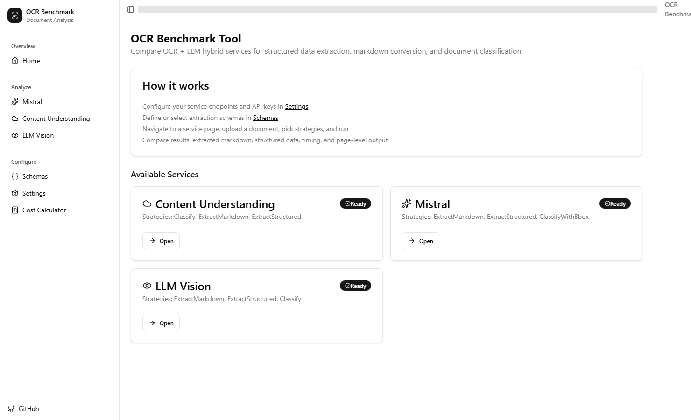
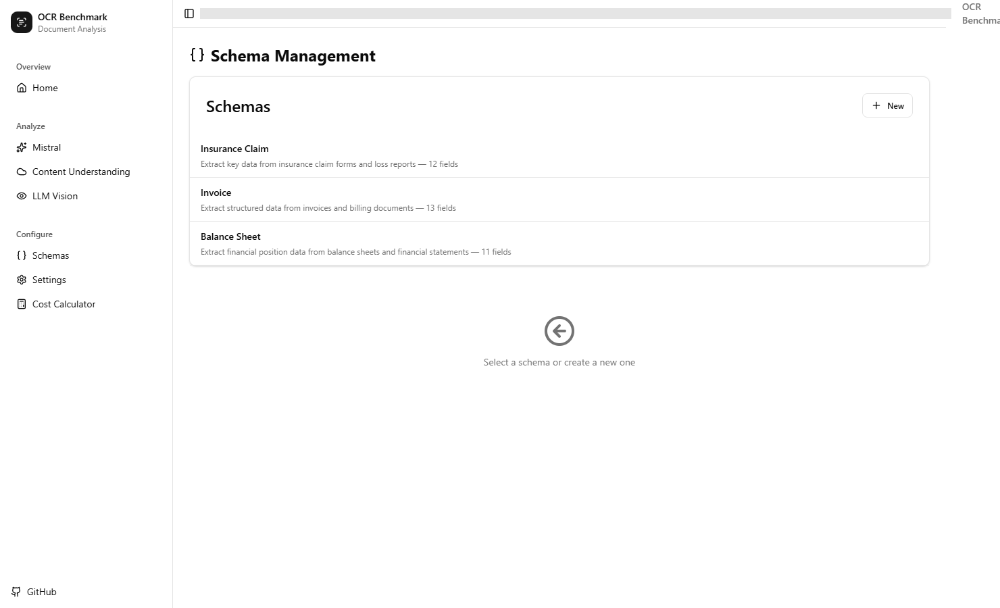
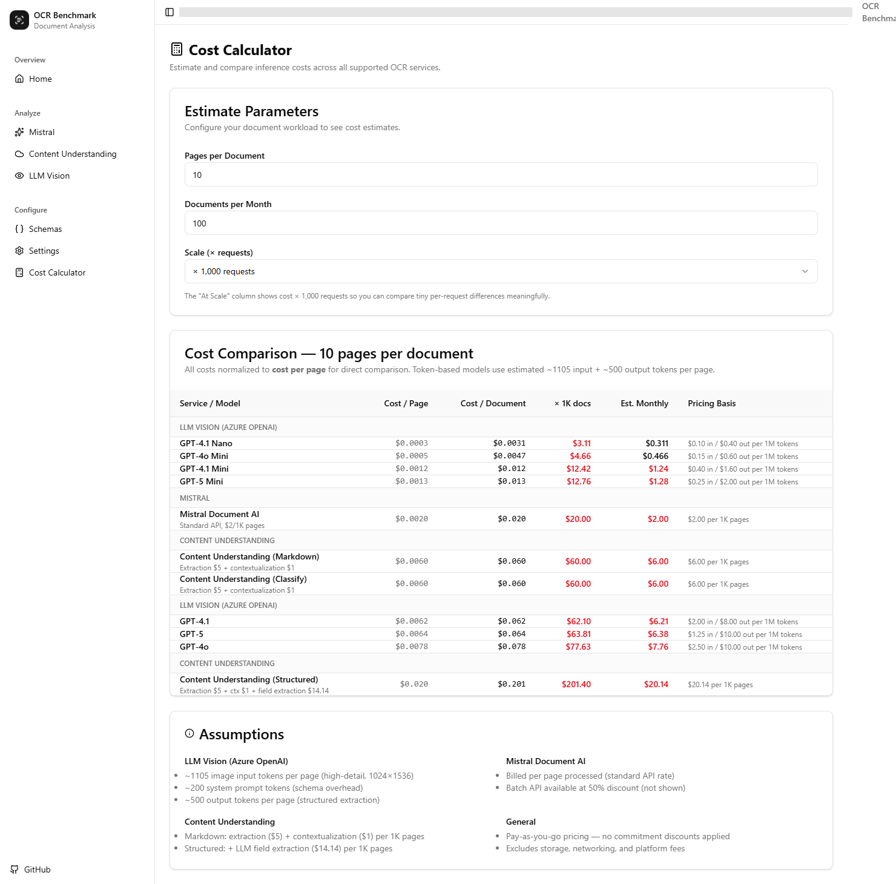

# Structured OCR Benchmark

[](https://dotnet.microsoft.com/)
[](LICENSE)

**Compare structured data extraction across Azure OCR and LLM services — side by side, with customizable schemas and cost estimates.**

## Screenshots

### Home


### Document Analysis


### Schema Editor


### Cost Calculator



## What is this?

Choosing the right approach for document extraction is hard. Each Azure service — Content Understanding, Mistral Document AI, OpenAI Vision — has different strengths, different APIs, and different trade-offs. Spinning up individual test harnesses for each one takes time you'd rather spend on your actual product.

Structured OCR Benchmark is a Blazor Server app that lets you upload a document, define an extraction schema, and run it against multiple services simultaneously. You get back structured JSON, raw markdown, classification results, timing, token usage, and estimated costs — all in one UI so you can make an informed decision.

## Features

- **Multi-service comparison** — Run the same document through Azure Content Understanding, Mistral Document AI, and Azure OpenAI Vision from a single interface
- **Customizable schemas** — Define what you want to extract using a visual form builder, or drop into raw JSON for full control
- **Multiple strategies per service** — Markdown extraction, structured data extraction, and document classification
- **Per-page results** — See extraction output broken down by page, with structured JSON where available
- **Timing & token tracking** — Elapsed time, input/output token split, and page counts per request
- **Cost estimation** — Inline estimated cost per analysis run, with a dedicated cost calculator page for cross-service comparison
- **Cost calculator** — Interactive `/cost-calculator` page with configurable page counts and monthly volume projections across all 12 model/strategy combinations
- **Modern UI** — Built with [Blazor Blueprint](https://blazorblueprintui.com/) (shadcn/ui for Blazor), featuring a collapsible sidebar, dark mode support, and Lucide icons
- **Zero-persistence setup** — In-memory config with optional `localStorage` persistence; nothing written to disk or a database

## Supported Services

| Service | Strategies | Notes |
|---------|-----------|-------|
| **Azure Content Understanding** | Classify, ExtractMarkdown, ExtractStructured | Uses the `Azure.AI.ContentUnderstanding` SDK. Configurable analyzer ID. |
| **Mistral Document AI** | ExtractMarkdown, ExtractStructured, ClassifyWithBbox | REST API via `mistral-document-ai-2512` (or custom model). Schema → JSON Schema translation built in. |
| **Azure OpenAI Vision** | ExtractMarkdown, ExtractStructured, Classify | Chat completions with vision. Supports multiple deployments (GPT-4o, GPT-4.1, GPT-5, and variants). Schema injected into system prompt. |

## Cost Estimation

The app includes a built-in cost estimator based on published pay-as-you-go pricing (March 2026). Costs are shown inline on each analysis result and can be explored in detail on the **Cost Calculator** page.

### Supported Pricing Models

| Service | Model | Rate |
|---------|-------|------|
| **Mistral Document AI** | mistral-document-ai-2512 | $2.00 / 1K pages |
| **Content Understanding** | Markdown extraction | $6.00 / 1K pages |
| **Content Understanding** | Structured extraction | $20.14 / 1K pages |
| **Azure OpenAI** | GPT-4o | $2.50 input / $10.00 output per 1M tokens |
| **Azure OpenAI** | GPT-4o Mini | $0.15 input / $0.60 output per 1M tokens |
| **Azure OpenAI** | GPT-4.1 | $2.00 input / $8.00 output per 1M tokens |
| **Azure OpenAI** | GPT-4.1 Mini | $0.40 input / $1.60 output per 1M tokens |
| **Azure OpenAI** | GPT-4.1 Nano | $0.10 input / $0.40 output per 1M tokens |
| **Azure OpenAI** | GPT-5 | $1.25 input / $10.00 output per 1M tokens |
| **Azure OpenAI** | GPT-5 Mini | $0.25 input / $2.00 output per 1M tokens |

> **Note:** These are estimates. Actual costs vary by region, commitment tier, and API version. The calculator excludes storage, networking, and platform fees.

## Getting Started

### Prerequisites

- [.NET 10](https://dotnet.microsoft.com/en-us/download/dotnet/10.0)
- An Azure subscription with at least one of the supported services deployed
- API keys / endpoints for the services you want to test

### Clone & Run

```bash
git clone https://github.com/EmileVerbunt/StructuredOcr.git
cd StructuredOcr
dotnet run --project StructuredOcr
```

The app starts at `https://localhost:5001` (or the port shown in the console).

### Quick Walkthrough

1. **Settings** — Navigate to `/settings` and enter your service endpoints and API keys
2. **Schemas** — Go to `/schemas` to define an extraction schema (or use one of the built-in ones)
3. **Analyze** — Open a service page (Mistral, Content Understanding, or LLM Vision), upload a document, select strategies, and hit **Run Analysis**
4. **Compare** — Review the results: raw markdown, structured JSON, document classification, timing, token usage, and estimated cost
5. **Cost Calculator** — Visit `/cost-calculator` to compare pricing across all services for different document volumes

## Configuration

### App Settings

Service endpoints and API keys are seeded from `appsettings.json`:

```json
{
  "OcrServices": {
    "ContentUnderstanding": {
      "Endpoint": "",
      "ApiKey": "",
      "ExtraSettings": { "AnalyzerId": "prebuilt-document" }
    },
    "Mistral": {
      "Endpoint": "",
      "ApiKey": "",
      "ModelName": "mistral-document-ai-2512"
    },
    "LlmVision": {
      "Endpoint": "",
      "ApiKey": "",
      "DeploymentNames": [],
      "ExtraSettings": { "ApiVersion": "2025-01-01-preview" }
    }
  }
}
```

> **Tip:** Use [.NET User Secrets](https://learn.microsoft.com/en-us/aspnet/core/security/app-secrets) to keep API keys out of source control:
> ```bash
> dotnet user-secrets set "OcrServices:Mistral:ApiKey" "your-key-here"
> ```

### Runtime Configuration

The **Settings** page (`/settings`) lets you update endpoints and API keys at runtime. Changes are stored in-memory and optionally persisted to `localStorage` in the browser.

## Schema System

Schemas define *what* to extract from a document. A single `UnifiedSchema` gets translated into each service's native format automatically.

### Field Types

| Type | Description |
|------|-------------|
| `String` | Text value |
| `Number` | Numeric value |
| `Boolean` | True/false |
| `Array` | List of items (with child field definitions) |
| `Object` | Nested object (with child field definitions) |

### Form Builder vs. JSON Editor

The Schemas page offers two editing modes:

- **Form mode** (default) — Add, remove, and configure fields visually. Array and Object types expand to show nested child fields.
- **JSON mode** — Switch to a raw JSON editor for full control. Useful for pasting schemas from elsewhere or making bulk edits.

Switching between modes syncs the data automatically. If the JSON is invalid when switching back to Form mode, you'll see an error and stay in JSON mode until it's fixed.

### Built-in Schemas

The app ships with three predefined finance schemas to get you started:

- **Insurance Claim** — Extracts claim/policy numbers, claimant details, loss type/description, line items with amounts, and claim status
- **Invoice** — Extracts invoice number, dates, vendor/buyer details with tax IDs, line items (description, qty, unit price, amount), subtotal/tax/total, and payment terms
- **Balance Sheet** — Extracts entity name, reporting period, current/non-current assets and liabilities with individual line items, equity breakdown, and totals

## Tech Stack

- **Framework:** .NET 10, Blazor Server (Interactive Server rendering)
- **UI:** [Blazor Blueprint](https://blazorblueprintui.com/) (shadcn/ui for Blazor) with Lucide icons and OKLCH theming
- **Azure SDKs:** `Azure.AI.ContentUnderstanding`, Azure OpenAI REST API, Mistral REST API

## Disclaimer

This is a **proof-of-concept / benchmark tool** for evaluating OCR and document extraction services. It is **not intended for production use**.

- All data is stored in-memory (no database, no disk persistence)
- There is no authentication or authorization
- Cost estimates are approximations based on published pricing and may not reflect actual billing
- Do not use with sensitive or confidential documents in shared environments

## Contributing

Contributions are welcome! If you find a bug, have a feature idea, or want to add support for another service:

1. Open an [issue](https://github.com/EmileVerbunt/StructuredOcr/issues) to discuss the change
2. Fork the repo and create a feature branch
3. Submit a pull request

## License

This project is licensed under the MIT License — see the [LICENSE](LICENSE) file for details.
